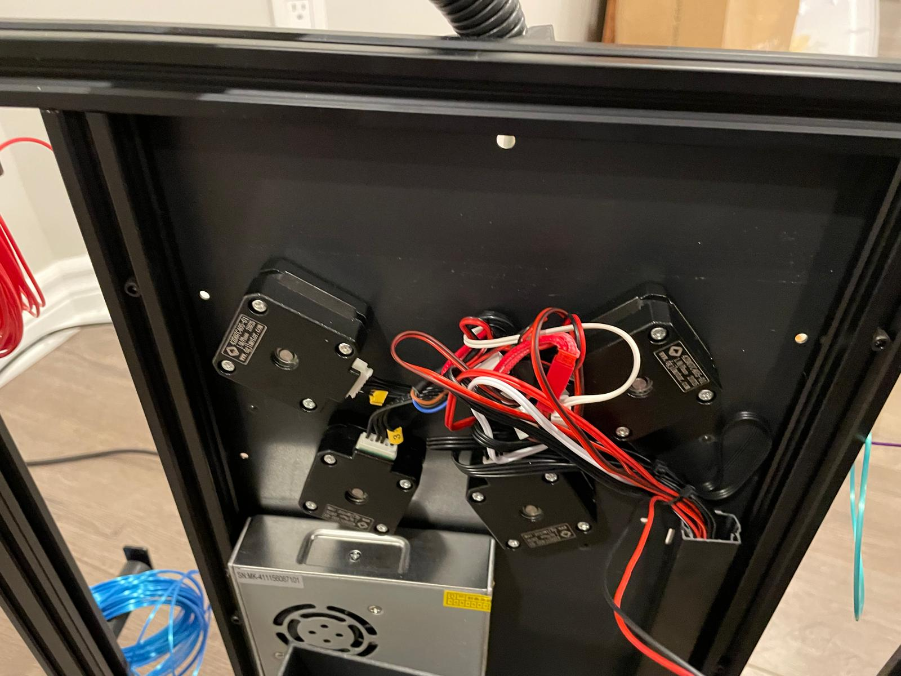
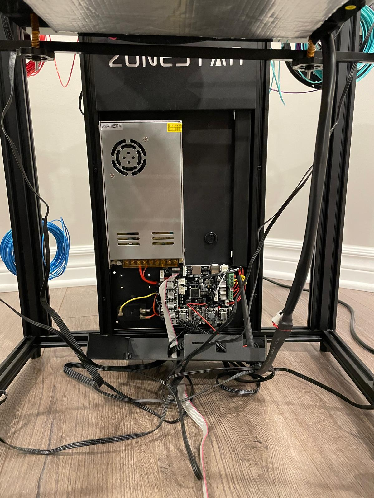
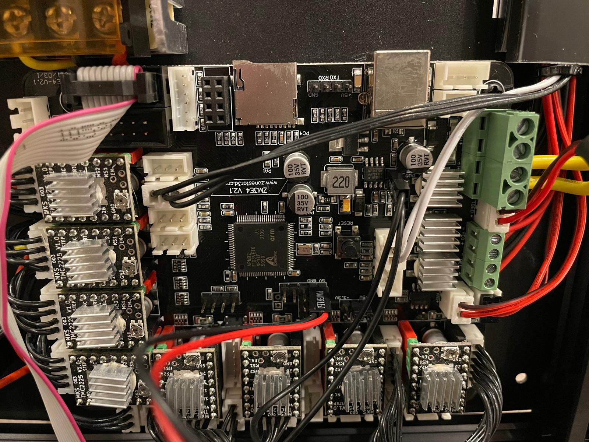

# Klipper profile for Z9V5Pro-MK4 (with non mixing E4 extruder)

Forked from: https://github.com/Z9V5PRO/Z9V5Pro-MK4-Klipper
In addition, found this: https://github.com/Nathan22211/Z9V5-mixing-klipper

## Printer overview
The covers are hold by 4 screws each:
* Top contains stepper motors of extruders and connectors to printing head:

* Bottom contains the main board:

* Zoom in:


The board is `ZM3E4 V2.1`:
* Schematics and parts placement were found in [Zonestar3D GitHub](https://github.com/ZONESTAR3D/Control-Board/tree/main/32bit/ZM3E4/ZM3E4V21)
* In schematics, it is `STM32F103VCT6`, but on board, it is clone `APM32 F103VET6` by [Geehy](https://global.geehy.com/product/fifth/APM32F103)

## Klipper Flashing procedure
1. Obtain Klipper by clonning it: [klipper3D](https://github.com/Klipper3d/klipper)
1. Configure by going to cloned folder in terminal and run
    ```
    make menuconfig
    ```
    in menu choose:
    * MCU Architecture - STM32
    * Processor model - STM32F103
    * Bootloader offset - 20KiB bootloader
    * Communication interface (USB(on PA11/PA12))
    and press `Q` and `Y` to save and exit
1. Build FW file by running:
    ```
    make
    ```
    it should complete without errors (otherwise install dependencies till it works).
    You will get `klipper.bin` in `./out/` folder.
1. Prepairing uSD-Card:
    1. Copy the `klipper.bin` to root of uSD-Card and rename it to `firmware.bin` 
    1. remove `old_fw.bin` if exists
    1. Unmount (eject) uSD-Card to cause `fsync`
1. Flashing printer:
    1. Power off power supply (PSU) of the printer
    1. Insert uSD-Card
    1. Power on PSU
    1. Press and hold for few sec small power button on bottom main board cover (the Zonestar logo might blink few times but will stay dark after it).

In my case, the printer wasn't found and power cycle didn't help. Looking on Linux logs using `journalctl -f` showed that it had USB detection errors and it was solved by eliminating USB-hub and plugging-in printer directly into PC:
Errors via hub:
```
Nov 02 02:44:20 pc-name kernel: usb 1-10.4: new low-speed USB device number 71 using xhci_hcd
Nov 02 02:44:20 pc-name kernel: usb 1-10.4: device descriptor read/64, error -32
Nov 02 02:44:20 pc-name kernel: usb 1-10.4: device descriptor read/64, error -32
Nov 02 02:44:21 pc-name kernel: usb 1-10.4: new low-speed USB device number 72 using xhci_hcd
Nov 02 02:44:21 pc-name kernel: usb 1-10.4: device descriptor read/64, error -32
Nov 02 02:44:21 pc-name kernel: usb 1-10.4: device descriptor read/64, error -32
Nov 02 02:44:21 pc-name kernel: usb 1-10-port4: attempt power cycle
```
Direct connection:
```
Nov 02 02:45:18 pc-name kernel: usb 1-8: new full-speed USB device number 77 using xhci_hcd
Nov 02 02:45:18 pc-name kernel: usb 1-8: New USB device found, idVendor=1d50, idProduct=614e, bcdDevice= 1.00
Nov 02 02:45:18 pc-name kernel: usb 1-8: New USB device strings: Mfr=1, Product=2, SerialNumber=3
Nov 02 02:45:18 pc-name kernel: usb 1-8: Product: stm32f103xe
Nov 02 02:45:18 pc-name kernel: usb 1-8: Manufacturer: Klipper
Nov 02 02:45:18 pc-name kernel: usb 1-8: SerialNumber: 28001100170000464C59504E
Nov 02 02:45:18 pc-name mtp-probe[732041]: checking bus 1, device 77: "/sys/devices/pci0000:00/0000:00:14.0/usb1/1-8"
Nov 02 02:45:18 pc-name kernel: cdc_acm 1-8:1.0: ttyACM0: USB ACM device
Nov 02 02:45:18 pc-name mtp-probe[732041]: bus: 1, device: 77 was not an MTP device
Nov 02 02:45:18 pc-name snapd[2187845]: hotplug.go:200: hotplug device add event ignored, enable experimental.hotplug
Nov 02 02:45:18 pc-name mtp-probe[732048]: checking bus 1, device 77: "/sys/devices/pci0000:00/0000:00:14.0/usb1/1-8"
Nov 02 02:45:18 pc-name mtp-probe[732048]: bus: 1, device: 77 was not an MTP device
```

## Changes from original:
1. Z-sensor wasn't mapped so added:
    ```
    [probe]
    pin: !PB13
    ...
    ```
2. Fixed bed dimensions
    * due to wiring Y axis getting stuck into motor connector and so Y movement limited by 300mm (bed is 310mm)
    * screw locations also fixed and added delta of z-sensor position (for some reason it doesn't get compensated automatically)
3. Calibrated `rotation_distance` for all 4 extruders

## Heaters PID calibrations
To calibrate both PID loops of heaters used:
```
    PID_CALIBRATE HEATER=extruder TARGET=200
    SAVE_CONFIG
    restart
    PID_CALIBRATE HEATER=heater_bed TARGET=60
    SAVE_CONFIG
    restart
```
results:


## Bed Mesh
Created initial bed mesh before fixing anything using GUI `HEIGHTMAP` clicking `CALIBRATE` and then running `SAVE_CONFIG` in console
result:


After that used
```
SCREWS_TILT_CALCULATE
```
to adjust screws and bring all corner to the same plane, and running mesh again:


Interestingly, I added plastic rectangle below PEI flexible top and the mesh didn't change, then added metallic ruler and the sensor was triggered even before going down. It means, that the sensor measures metal plate/magnetic sticker and not real bed position. Hopefully, switching to steel PEI plate will solve the issue. 
Another option is to switch to BLTouch sensor that uses mechanical contact instead of inductive proximity sensor.
